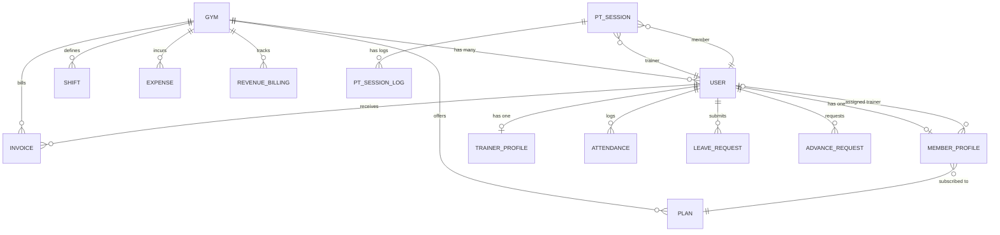

# Phase 1: System Overview & Architecture Mapping

## 1. Executive Summary

This repository contains a full-stack gym and athletic club management platform (**PulseFit Pro** / **ArchFit**). It features a multi-role React Single Page Application (SPA) on the frontend, a Laravel 11 REST API on the backend, and a MySQL relational database. The platform also includes Capacitor configurations for mobile Android deployment and eSSL / ZKTeco biometric device integration.

---

## 2. Technology Stack

| Layer | Technologies | Notes |
|---|---|---|
| **Frontend** | React 19, Vite 8, TailwindCSS 4, Lucide Icons, Recharts, jsPDF, html2canvas | SPA architecture with custom tab navigation and offline fallback caching |
| **Mobile** | Capacitor 8 (Android runtime) | Native back button integration, hardware push integration |
| **Backend** | Laravel 11.x, PHP 8.2+, Laravel Sanctum | API routing via `/api/v1/` and ADMS biometric routes |
| **Database** | MySQL (InnoDB, utf8mb4) | 46 migrations, 39 Eloquent models, foreign key relationships |
| **Authentication** | Laravel Sanctum API Tokens (`Bearer`) | State synced with client `localStorage` (`pulsefit_token`, `pulsefit_currentUser_v2`) |
| **Background Processing** | `sync` queue driver | No persistent queue daemon; triggers and syncs run in-request |

---

## 3. Architecture & Connectivity

### 3.1 React & Laravel Connection
- **Architecture**: Decoupled Client-Server SPA.
- **API Base**: Defaults to `http://127.0.0.1:8000/api/v1`.
- **Dynamic Failover**: `frontend/src/services/api.js` implements auto-detection and fallback across localhost, LAN IPs (e.g. `192.168.1.48`), Android emulator gateway (`10.0.2.2`), and same-origin production domains.
- **Request Headers**: All authenticated API requests include:
  - `Authorization: Bearer <pulsefit_token>`
  - `X-Gym-Id: <pulsefit_gym_id>`
  - `Accept: application/json`
  - `Content-Type: application/json`

### 3.2 Authentication & Authorization Flow
1. **Login Flow**:
   - Client sends credentials (`login`, `password`) to `POST /api/v1/auth/login`.
   - Backend matches against `email`, `phone`, `name`, or username; validates hashed password (`Hash::check`) with legacy plaintext fallback (`plain_password`, `initial_password`).
   - If successful, returns a Sanctum personal access token (`plainTextToken`) and user payload.
   - Client stores token in `localStorage.pulsefit_token` and active gym ID in `localStorage.pulsefit_gym_id`.
   - Offline / Fallback: If backend is unreachable, frontend falls back to pre-seeded credentials cached in `localStorage`.
2. **Roles & Permissions**:
   - `superadmin`: Platform-wide control, gym provisioning, gym impersonation.
   - `owner`: Full operational, financial, payroll, and membership management within their gym.
   - `manager`: Operational management (members, attendance, classes, enquiries) with restrictions on financial and payroll screens.
   - `accounts`: Finance-oriented operations.
   - `trainer`: Personal trainer dashboard, client workouts/diets, session logs, advance pay requests, leave requests.
   - `member`: Athlete self-service dashboard, class bookings, QR pass, workouts, diet routines, payment history.

---

## 4. Backend Directory & Component Structure

```
backend/
├── app/
│   ├── Http/
│   │   ├── Controllers/
│   │   │   ├── Controller.php               # Base controller with resolveGymId()
│   │   │   └── Api/                         # 27 API Controllers
│   │   │       ├── AuthController.php
│   │   │       ├── DashboardController.php
│   │   │       ├── MemberController.php
│   │   │       ├── TrainerController.php
│   │   │       ├── PlanController.php
│   │   │       ├── InvoiceController.php
│   │   │       ├── ShiftController.php
│   │   │       ├── StaffController.php
│   │   │       ├── OperationsController.php
│   │   │       ├── RevenueBillingController.php
│   │   │       ├── AdmsController.php
│   │   │       ├── WhatsAppController.php
│   │   │       └── ...
│   ├── Models/                              # 39 Eloquent Models
│   │   ├── User.php
│   │   ├── Gym.php
│   │   ├── MemberProfile.php
│   │   ├── TrainerProfile.php
│   │   ├── Invoice.php
│   │   ├── RevenueBilling.php
│   │   ├── Shift.php
│   │   ├── AdvanceRequest.php
│   │   ├── PtSession.php
│   │   ├── WhatsAppTemplate.php
│   │   └── ...
│   └── Providers/
│       └── AppServiceProvider.php
├── bootstrap/
│   └── app.php                              # Laravel 11 routing, CSRF exclusions, exception handling
├── config/                                  # App, auth, database, cors, sanctum configurations
├── database/
│   ├── migrations/                          # 46 migration files
│   └── seeders/                             # 8 seeder classes
└── routes/
    ├── api.php                              # Main API routes (v1 prefix and ADMS routes)
    ├── web.php                              # Web routes, SPA index fallback, duplicate api include
    └── console.php                          # Artisan console commands
```

---

## 5. Frontend Directory & Component Structure

```
frontend/
├── src/
│   ├── App.jsx                              # Root router, tab state machine, native back handler
│   ├── main.jsx                             # React DOM entry point
│   ├── index.css                            # Global CSS and Tailwind directives
│   ├── context/
│   │   ├── AuthContext.jsx                  # Authentication state, login/logout, seed fallbacks
│   │   └── GymDataContext.jsx               # Universal gym data state, CRUD handlers, caching
│   ├── services/
│   │   └── api.js                           # Unified REST client with failover & header injection
│   ├── utils/
│   │   ├── dateUtils.js                     # Date formatting helpers
│   │   ├── invoicePdfGenerator.js           # Client-side PDF generator (jsPDF)
│   │   ├── validation.js                    # Form input validators
│   │   └── whatsapp.js                      # WhatsApp link and formatting utilities
│   └── components/
│       ├── auth/                            # LoginPage, ForceChangePasswordModal
│       ├── common/                          # Navbar, Sidebar, Modal, StatCard, ToastContainer, etc.
│       ├── member/                          # 8 Member portal views
│       ├── trainer/                         # 9 Trainer portal views
│       ├── owner/                           # 29 Owner & Manager views (Members, Invoices, Shifts, etc.)
│       └── superadmin/                      # Superadmin App, Dashboard, Login
```

---

## 6. Key Data Relationships



---

## 7. Identified Architectural Observations for Subsequent Phases

1. **Route Redundancy**: `backend/routes/web.php` includes `api.php` under `Route::middleware('api')` while `bootstrap/app.php` already mounts `api.php` under the `/api` prefix. This results in duplicate registered routes (331 routes total).
2. **API Route Authentication Coverage**: In `backend/routes/api.php`, almost all `/v1/*` routes (including member CRUD, financial invoices, payroll, and staff accounts) are declared outside `auth:sanctum` middleware. The base controller falls back to `Gym::first()` when unauthenticated, meaning data can be accessed without a valid token.
3. **Hardcoded Sensitive Data**:
   - `backend/routes/api.php` lines 101–103 and 151 contain hardcoded fallback DB credentials and setup keys.
   - Frontend `AuthContext.jsx` and `GymDataContext.jsx` contain plain hardcoded test credentials and fallback mock arrays.
4. **Password Exposure**: `User.php` has `plain_password` in `$fillable` without being in `$hidden`, which risks leaking plaintext passwords during serialization.
5. **Formatting and Linting**: Pint reported formatting inconsistencies across controllers, migrations, and routes; oxlint flagged unused seed constants and duplicate keys in `GymDataContext.jsx`.

---
*Generated as part of Safety Setup & Phase 1 of the Ponytail audit ruleset.*
